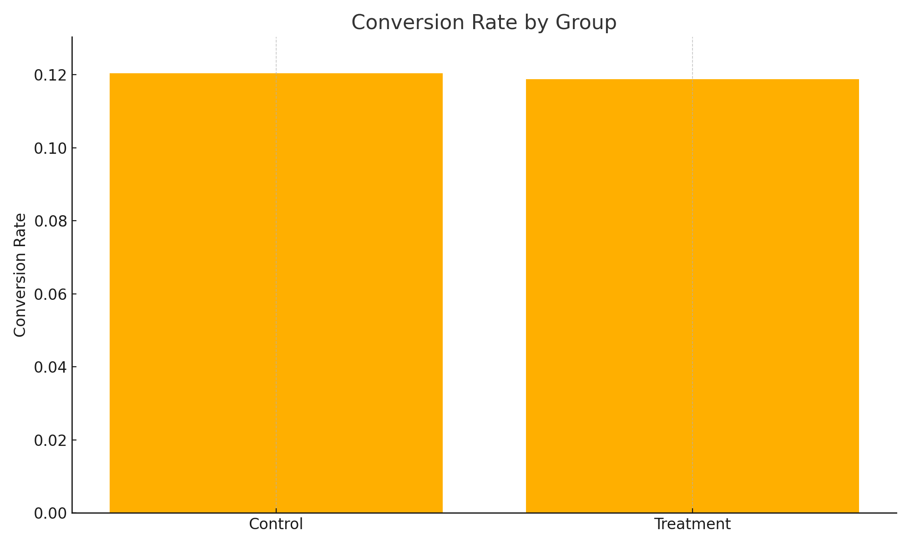

# 🧪 A/B Testing Project: Does the New Landing Page Improve Conversions?

This project analyzes A/B testing data to evaluate whether a new landing page design increases user conversion rates compared to the original version.

---

## 📂 Dataset

- Source: https://www.kaggle.com/datasets/zhangluyuan/ab-testing
- Total records: 294,478  
- Cleaned valid records: 290,585  
- Columns:
  - `user_id`: Unique user identifier
  - `timestamp`: Visit time
  - `group`: A/B test group (`control` or `treatment`)
  - `landing_page`: Page shown (`old_page` or `new_page`)
  - `converted`: Whether the user converted (1 = yes, 0 = no)

---

## 📊 Key Findings

| Group     | Conversion Rate | Total Users | Conversions |
|-----------|------------------|--------------|--------------|
| Control   | 12.04%           | 145,274      | 17,489       |
| Treatment | 11.88%           | 145,311      | 17,264       |

- **Z-score**: -1.3116  
- **P-value**: 0.9052  
- **Conclusion**: ❌ No statistically significant difference in conversion rates.  
  > We fail to reject the null hypothesis.

---

## 🧠 Interpretation

Although the treatment group saw a slightly lower conversion rate, the difference is not statistically significant. This suggests that switching to the new landing page may not meaningfully improve conversions.

---

## 🧰 Tools & Libraries

- Python: `Pandas`, `Scipy`, `Matplotlib`
- Statistical Test: Z-test for proportions
- Visualization: Bar chart of conversion rates

---

## 📈 Visualization

---
